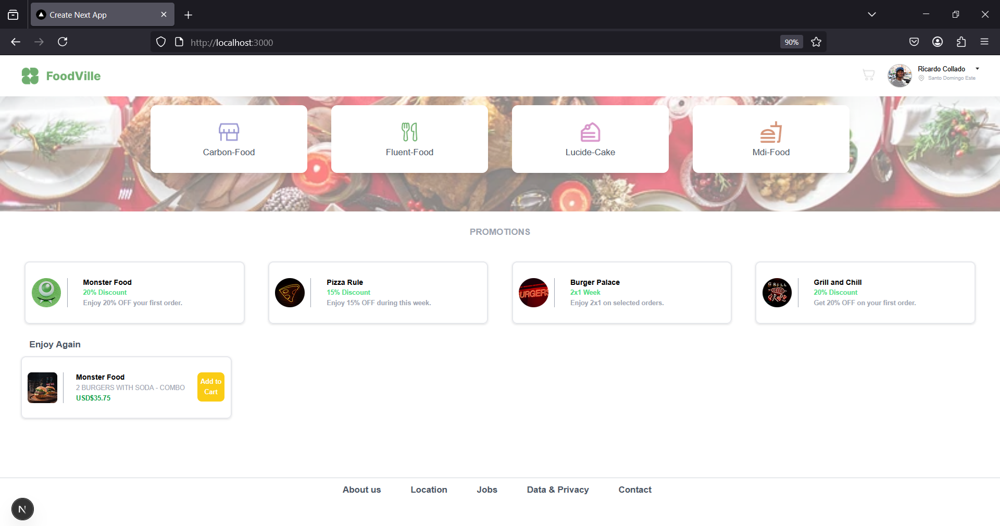

# 🍔 Restaurant Landing Page

Landing page para un restaurante construida con **Next.js 15**, **React**, y **TailwindCSS**.

## 🚀 Tecnologías

- [Next.js 15](https://nextjs.org/)
- [React](https://reactjs.org/)
- [Tailwind CSS](https://tailwindcss.com/)
- CSS Utility-first y diseño responsive

## 📸 Vista previa




## 🧱 Estructura de la app

El landing incluye:
- 🔝 Navbar fijo con logo y perfil
- 📋 Sección de servicios disponibles
- 💸 Promociones activas
- 🍽️ Historial de pedidos recientes
- 📫 Footer con enlaces informativos

## ▶️ Instalación y uso

```bash
# Clona el repositorio
git clone https://github.com/tu-usuario/restaurant-landing.git
cd restaurant-landing

# Instala dependencias
npm install

# Inicia el servidor de desarrollo
npm run dev
